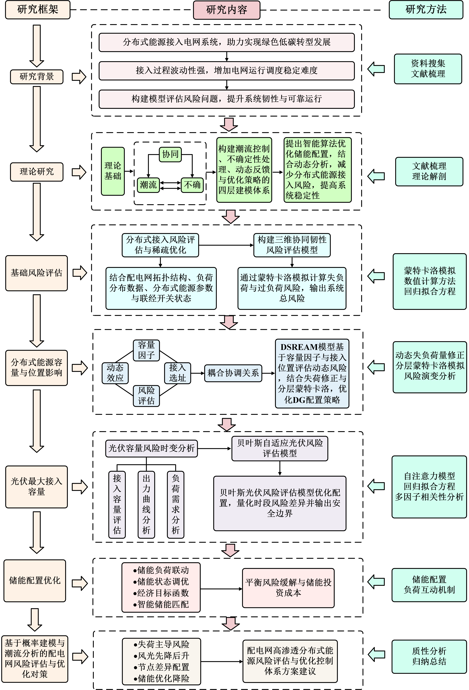

# 中国省域碳减排路径优化的多模型建模研究



> 赵明艳 · 队长  
> 全国大学生统计建模大赛上海赛区 · 上海市二等奖

本项目聚焦中国省域碳减排路径优化问题，围绕能源替代、区域协同与政策联动三个层面，构建融合 LSTM、DQN 与 Transformer 的多模型建模框架，用于支持差异化减排路径识别与政策组合评估。

## 联系方式

- **队长**：赵明艳
- **邮箱**：`zhaomingyan@stu.shmtu.edu.cn`

## 项目简介

在“双碳”目标持续推进背景下，省域间能源结构、产业分布与政策环境存在显著差异，传统以行政边界为主的统一减排模式难以兼顾效率与协同性。针对这一问题，本项目从多层次建模角度出发，形成面向省域尺度的碳减排路径优化研究框架。论文主体对应三条核心建模主线：能源替代建模、区域协同建模与政策联动建模。

## 研究内容

- **能源替代建模**：基于 LSTM 模型分析新能源替代潜力与碳减排贡献
- **区域协同建模**：基于 DQN 模型探索跨区域碳减排资源匹配路径
- **政策联动建模**：基于 Transformer 模型模拟政策组合对碳脱钩效果的影响

## 仓库内容

- `paper/`：项目论文成品
- `figures/`：项目总技术路线图、研究框架图、模型总体框架图
- `data/`：部分数据样例（如已上传）

## 仓库结构

```text
carbon-pathway-modeling/
├─ README.md
├─ paper/
│  └─ statistical_modeling_paper.pdf
├─ figures/
│  ├─ overall_technical_route.png
│  ├─ research_framework.png
│  └─ overall_model_framework.png
└─ data/
   └─ sample_data.xlsx
```

## 联系方式

- 邮箱：zhaomingyan@stu.shmtu.edu.cn
